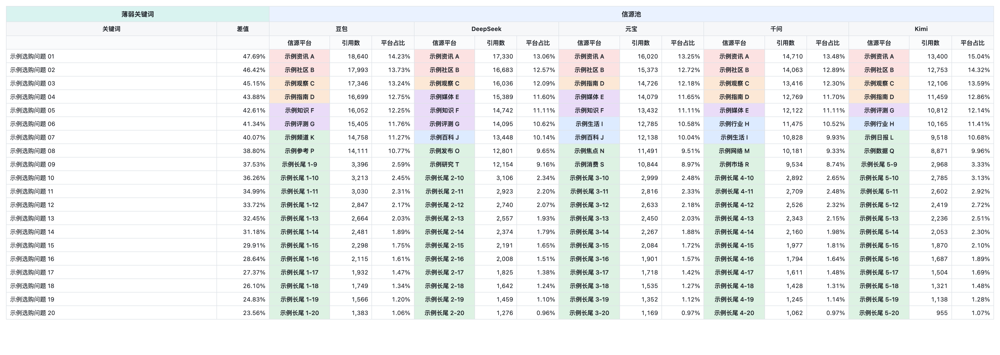

# BANG GEO Monitor

一个可公开复用的 Codex Skill：输入客户名称，自动读取最近的 GEO 采集报告，识别薄弱关键词与小优势关键词，汇总五个 AI 平台的 Top 20 信源池，并把每日结果写入飞书表格。

默认分析最近 **10 次**已完成且已生成报告的采集任务。也可以在调用时改成 2、3、5、7 或任意大于 0 的次数。



> 演示图使用完全合成的关键词、计数和信源分布，不包含任何客户名称、任务 ID、报告链接或真实业务数据。

## 能做什么

- 从移山 GEO MCP 检索客户、采集任务和生成后的报告。
- 默认选取最近 10 次有效采集，自动跳过运行中或尚未生成报告的任务。
- 用最新一份对内报告计算薄弱关键词和高于竞品但优势较小的关键词。
- 聚合所选全部对外报告，生成豆包、DeepSeek、元宝、千问、Kimi 的 Top 20 信源池。
- 在用户指定的飞书目录中创建或复用客户数据监测表，每天一个工作表。
- 写入后回读内容和样式，避免把“已发起写入”误报成“已完成”。

## 隐私设计

公开仓库不包含：

- 客户名称、关键词、竞品、采集次数或历史报告数据。
- 飞书租户域名、Space ID、Node Token、Spreadsheet Token。
- MCP Bearer Token、API Key 或报告下载 URL。公开的 MCP 服务地址可以写入安装说明，但凭据不得提交。
- 任何历史客户模板 Token。

BANG 不再复制其他客户的飞书表格作为模板，而是按固定规范从空白工作表生成输出。

## 前置条件

- Codex 桌面端、CLI 或 IDE 扩展。
- 移山科技提供的 GEO MCP 地址和访问凭据。
- 当前 Codex 环境中已经授权的飞书写入工具，并且对目标飞书链接有编辑权限。
- Python 3.9 或更新版本。运行时只使用标准库。

仓库本身、安装脚本和分析脚本均为免费开源。移山 MCP 与飞书账号的访问条件由对应服务提供方决定。

## 安装

```bash
git clone https://github.com/GEO-Growth-Labs/bang-geo-monitor.git
cd bang-geo-monitor
./install.sh
```

安装脚本会把 `skills/bang` 复制到官方用户级目录 `~/.agents/skills/bang`。如果已存在同名 Skill，脚本会停止，不会覆盖。

需要安装到其他目录时，可显式指定：

```bash
export AGENTS_SKILLS_HOME='/your/skills/directory'
./install.sh
```

Codex 通常会自动发现新 Skill；如果 `$bang` 没有出现，请重启 Codex。

## 首次配置

只配置两项：移山 GEO MCP，以及飞书写入目标链接。

### 1. 配置移山 GEO MCP

在 Codex 设置中打开 **MCP servers**，添加一个 Streamable HTTP 服务，命名为 `wanhu-admin`，URL 格式为 `http://8.xxx.xx.133:1024/mcp`。请向移山科技团队获取完整地址和 Bearer Key，然后重启 Codex。公开版固定使用该名称，使 Skill 元数据、配置预检和运行时工具保持一致。

也可以使用 CLI。不要把真实 Token 写进本仓库：

团队 JSON 中的 `headers.Authorization = Bearer ...` 与下面配置逻辑一致；这里改用环境变量保存完整 Key，避免凭据出现在命令历史、README 或 Git 提交中。

```bash
export WANHU_ADMIN_BEARER_TOKEN='<完整 agt_ Key>'
codex mcp add wanhu-admin \
  --url 'http://8.xxx.xx.133:1024/mcp' \
  --bearer-token-env-var WANHU_ADMIN_BEARER_TOKEN
```

检查 MCP 是否已登记：

```bash
codex mcp get wanhu-admin
```

### 2. 配置飞书写入链接

把链接替换为你有编辑权限的飞书 Wiki 目录或表格节点：

```bash
BANG_SKILL_DIR="${AGENTS_SKILLS_HOME:-$HOME/.agents/skills}/bang"
python3 "$BANG_SKILL_DIR/scripts/configure.py" \
  --mcp-server wanhu-admin \
  --feishu-parent-url 'https://your-team.feishu.cn/wiki/YOUR_NODE_TOKEN'
```

配置保存在 `~/.config/bang/config.json`，权限设置为当前用户可读写，不在 Git 仓库内。检查时只显示脱敏后的链接：

```bash
BANG_SKILL_DIR="${AGENTS_SKILLS_HOME:-$HOME/.agents/skills}/bang"
python3 "$BANG_SKILL_DIR/scripts/configure.py" --show
```

## 使用

默认最近 10 次：

```text
$bang 示例品牌
```

指定最近 5 次：

```text
$bang 示例品牌 最近5次
```

同样支持：

```text
BANG 示例品牌 最近7次
给示例品牌跑一版 BANG，取最近3次
```

客户名称缺失时，Skill 只询问客户名称。采集次数缺失时直接使用 10，不再额外打断。

显式次数必须是大于 0 的整数；`0`、负数、小数或非数字会在采集前要求更正。如果有效报告少于请求次数，BANG 使用全部可用报告并在结果中说明实际数量。

## 输出口径

- 薄弱关键词：客户平均可见占比低于核心竞品平均值，按差值从大到小排列。
- 小优势关键词：客户平均可见占比高于核心竞品平均值，按优势从小到大排列。
- 信源池：按 AI 平台汇总所选报告中的信源文章数，归一化同一平台的常见域名/名称后取 Top 20。
- 平台占比：该信源文章数除以该 AI 平台在全部所选报告中的总文章数，而不是除以 Top 20 小计。
- 颜色：同一信源进入五个平台 Top 20 的次数越多，标记优先级越高；只标信源名称单元格。

完整表格规范见 [`skills/bang/references/feishu-output-spec.md`](skills/bang/references/feishu-output-spec.md)。

## 本地验证

```bash
python3 -m unittest discover -s tests -v
python3 tools/check_public_release.py
python3 tools/validate_skill.py
```

GitHub Actions 会对每次提交执行单元测试、Skill 元数据检查和敏感信息规则扫描。

## 项目结构

```text
skills/bang/
├── SKILL.md
├── agents/openai.yaml
├── config.example.json
├── references/
└── scripts/
```

## 参与贡献

问题与改进建议请提交 GitHub Issue。代码贡献见 [CONTRIBUTING.md](CONTRIBUTING.md)，安全问题见 [SECURITY.md](SECURITY.md)。

## License

[MIT](LICENSE)
